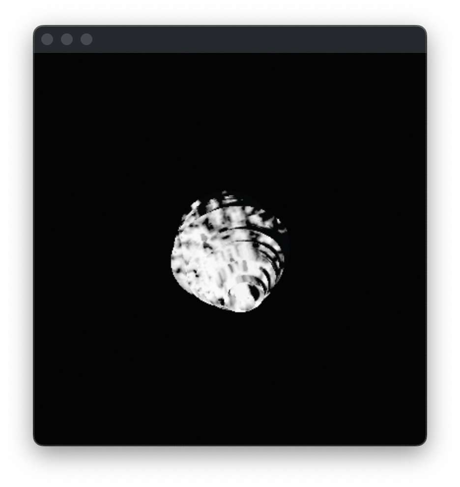

# for breathing disaster # 
Live visualizer for *BRIDGES IV - for breathing disaster* by Ægir Sindri Bjarnason.

<picture>
  
</picture>

<picture>
  
</picture>

<picture>
  
</picture>

## for breathing disaster ##

This is a partially audio-reactive live controllable visualizer we made in Godot for a specific live set.
It has multiple controllable elements that we mapped to a MIDI controller for live performance.

We developed it on the fly with very rapid changes so the code is as messy as can be. This is the entire codebase so you can inspect/steal/look down on every part of it.

It uses two separate screens (one projected on a large wall behind the performer, the other on a cloth screen in front of him).

The large back screen shows a thin orange horizon and a tiny planet sort of shape in the distance. The small screen has a top down view of the same planet and we see that its circles of latitude are affected by the sounds we hear.

### Controls ###
The audio is directly affecting the planet's shape. All other aspects are controlled live with some kind of controller. The first version had MIDI mapped controls for:
1. How thick/thin the horizon is. One control with a set minimum (so the horizon is always at least a small line) and another that can "turn it off" and make the entire sky black.
2. The brightness and color of the sky. One extreme is a black sky and the other is a dark-ish blue.
3. How fast the spectator moves toward the planet.
4. How fast the planet is spinning on its own.
5. Rotating the horizon line.
6. Saturation of the entire image (1 = all colors normal, 0 = everything is black and white)
7. Last but not least a destruction slider that adds grain and chromatic aberration that gets more and more intense until it starts strobing and turns into complete chaos

<!-- 
It starts with a 
weird planet kind of shape floating in space and rotating, way in the distance. Behind the planet is a thin orange
horizon The spectator (our point of view) moves closer and closer to the planet, as we approach it the horizon
line grows and the sky lightens and turns blue. We see the planet  -->
